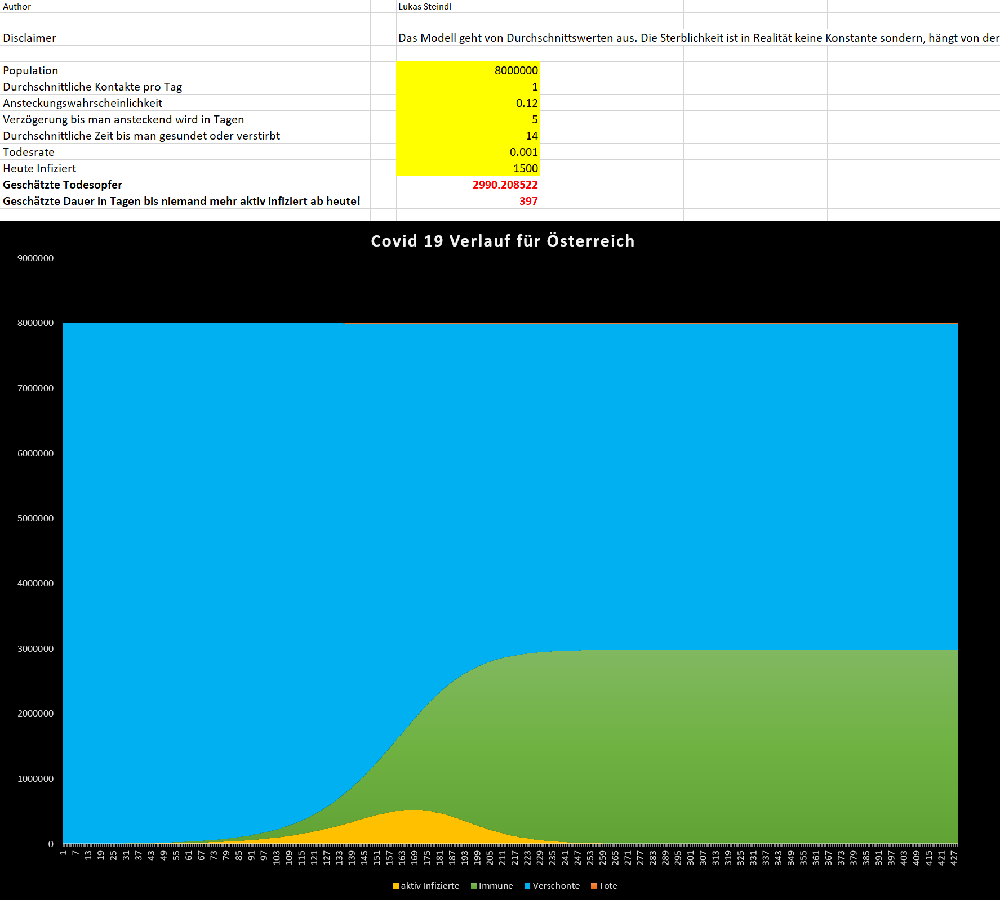
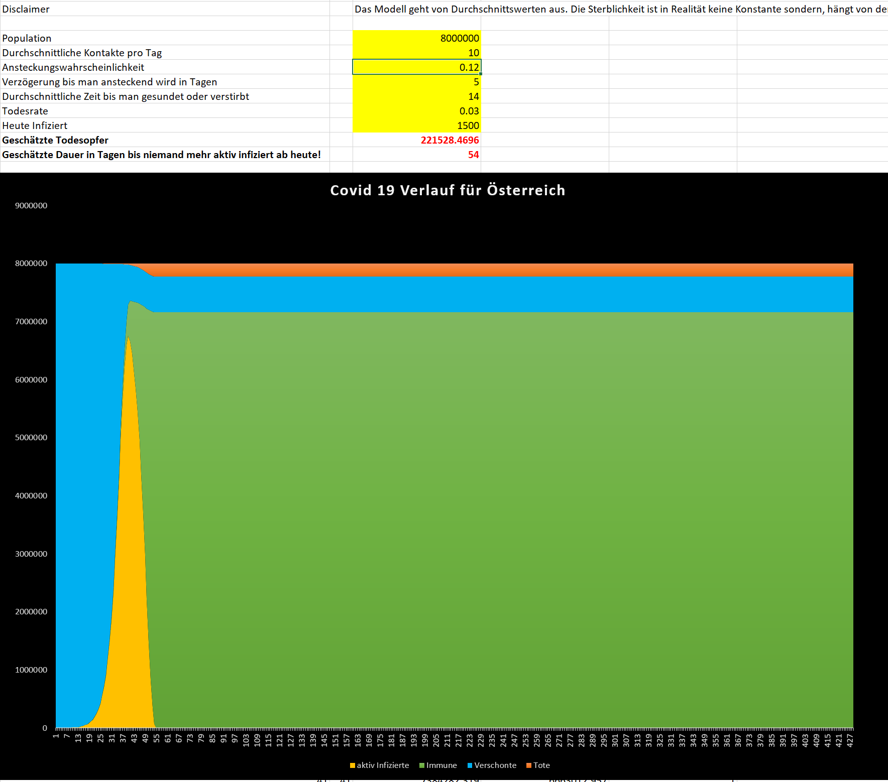

# covid19model
Excel Modell zur Simulation der Covid-19 Ausbreitung. 
Die Parameter basieren auf Annahmen die nicht zutreffen müssen. Weiters könnten noch Fehler im Modell enthalten sein. 

Hier ein zwei Szenarien für Österreich:
Bei hoher Isolation ergibt sich ein milder aber langer Verlauf: 
(In diesem Fall dauert es fast 400 Tage bis es keine aktiv Infizierten mehr gibt.)

Wenn jeder Mensch täglich 20 andere Menschen treffen würde ergäbe sich folgender Verlauf:
Hier wäre bereits nach 54 Tagen niemand mehr infiziert. Jedoch würden viele Menschen sterben.

