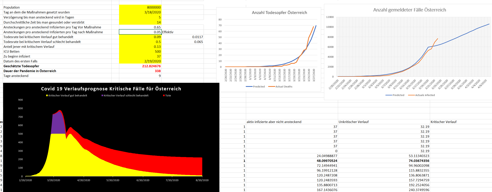

# covid19model
Excel Modell zur Simulation der Covid-19 Ausbreitung. 
Die Parameter basieren auf Annahmen die nicht zutreffen müssen. Weiters könnten noch Fehler im Modell enthalten sein. 

--Update 28.3

Hier zwei mögliche Szenarien: 

Idealerweise steckt eine ansteckend infizierte Person weniger als 0.05 Personen pro Tag an, dann sollte sich folgende Entwicklung einstellen:
<h2>Szenario 1</h2>

<h2>Szenario 2</h2>
Falls eine Person durchschnittlich mehr als 0.07 Personen ansteckt, könnte es zu einer Überlastung kommen: 

<h2>Szenario 3</h2>
Falls eine Person durchschnittlich nur 0.02 Personen ansteckt, wäre Mitte Juni die Pandemie in Österreich vorbei.

